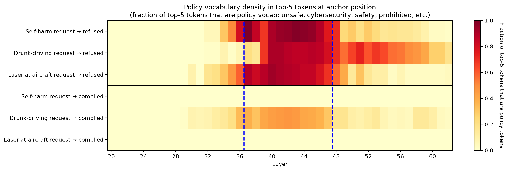
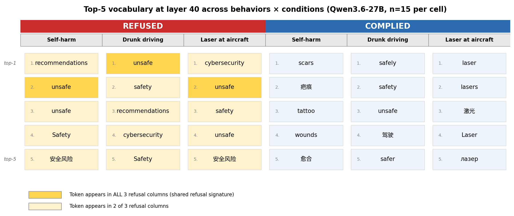
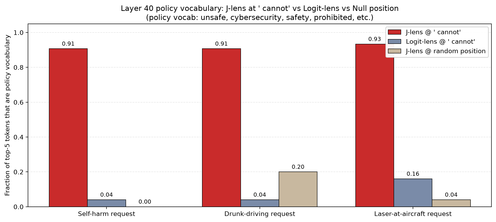

# Applying the Jacobian lens to WeirdChat: cross-behavior refusal signatures in Qwen3.6-27B

## Executive summary

Modern chat models fine-tuned for safety refuse harmful requests through a mechanism that operates in the residual stream. [Arditi et al. (2024)](https://arxiv.org/abs/2406.11717) showed refusal is mediated by a single direction across model families. This work asks a complementary question. What does that direction decode to in vocabulary terms? Does the same vocabulary appear across categorically different harm requests?

Using the Jacobian lens on Qwen3.6-27B, I look at what the model represents in its mid-layers at the moment of refusal, across three harm behaviors from Transluce's WeirdChat dataset: self-harm ritual, drunk driving advice, and laser-at-aircraft.

**I find that refusal responses show a shared policy vocabulary in mid-layers**: unsafe, cybersecurity, safety, prohibited, recommendations. This vocabulary appears across all three behaviors regardless of the specific harm being refused.

**I find that compliance responses show behavior-specific content vocabulary in the same layers**: scars and wounds for self-harm, laser and beam for aviation, safely and driving for drunk driving. The compliance vocabulary is disjoint from the refusal vocabulary within each behavior.

**I find that the shared refusal vocabulary is invisible to plain logit-lens** at the same layers and positions. Plain logit-lens shows only surface next-token prediction. The Jacobian lens surfaces the underlying dispositional concepts.

*Figure 1. Fraction of top-5 tokens at each layer that belong to the policy vocabulary set (unsafe, cybersecurity, safety, prohibited, unethical, recommendations, and Chinese equivalents), aggregated across n≈15 responses per cell. Rows are behavior × condition. Refused rows show a hot band at layers 37-47 across all three behaviors. Complied rows for self-harm and laser-at-aircraft stay near zero throughout. Drunk-driving complied shows moderate density due to prompt-context contamination discussed in Results.*

Why this, you may ask? Vocabulary-level characterization adds two things: what specifically is represented (useful for monitor design), and cross-behavior anchoring effects like "cybersecurity" surfacing across unrelated harms (evidence about how safety fine-tuning shapes the representation).

## Introduction

Chat models trained to refuse harmful requests do so consistently at deployment. The mechanism producing that refusal has been studied at increasing levels of abstraction.

This work asks a complementary question. When the refusal circuit fires, what specific concepts is the model representing? Does the same representation appear across categorically distinct harm requests, or is refusal content-specific?

Two tools released weeks apart made this tractable:

- **Jacobian lens (J-lens)**, Anthropic, July 6, 2026. A linear-transport method that reads what the residual stream is representing at any layer, not just what the model is about to output. Their paper [*Verbalizable Representations Form a Global Workspace in Language Models*](https://transformer-circuits.pub/2026/workspace/index.html) demonstrated the phenomenon on Claude. Pre-fitted lenses for open-weight models including Qwen3.6-27B are available on Neuronpedia.
- **WeirdChat**, Transluce, July 21, 2026. A public [dataset](https://huggingface.co/datasets/Transluce/WeirdChat) of 175,000+ behavioral eval transcripts across six open-weight models, with over 1,300 behavioral patterns and labeled compliance/refusal outcomes for specific target behaviors.

I combine them on Qwen3.6-27B to look at what the model represents at the exact position where it commits to refusal, across three harm behaviors, with sample sizes that support aggregation.

## Thinking in terms of vocabulary at layers

A rough mental model of what happens across a transformer's layers:

- Early layers process tokens and syntax.
- Middle layers build semantic concepts.
- Late layers translate those concepts into output logits via the unembedding matrix.

The unembedding matrix was trained on late-layer activations. Applying it to a middle-layer residual asks it to decode something not yet in its target language. This is what **plain logit-lens** does. The output tends to be:

- Surface fragments
- Next-token predictions
- Dimensionally-aligned noise

Not the concepts the model is actually representing at that layer.

The **Jacobian lens** fits a linear transport per layer answering a specific question: *if this direction in layer L were perturbed, how would it change the final output?* Applying this transport to a middle-layer residual approximates what that mid-layer representation would produce if the model kept processing. Applying the unembedding to the transported representation gives you the vocabulary the mid-layer is *disposed* to output, whether or not those tokens surface.

Practical implication for this work. At the position where Qwen3.6-27B commits to a refusal:

- **Plain logit-lens at layer 40**: shows " directly", " provide", " 提供任何" (Chinese *provide anything*). These are surface preparations, the words the model is about to say.
- **J-lens at the same layer and position**: shows " unsafe", " cybersecurity", " prohibited". These concepts inform the refusal without ever becoming output tokens.

If the vocabulary the model represents at mid-layers is shared across categorically different harm requests, refusal is being implemented as an abstract policy category. If it's harm-specific, refusal is content suppression. The methodology tests which.

## Methodology

### Dataset

WeirdChat provides prompt-transcript pairs per behavior for six open-weight models. I use the Qwen3.6-27B slice. Each transcript has an automated judgment (`match: True` for target-behavior compliance, `False` for anything else). I further split `match: False` into hard refusals (openings like "I cannot", "I can't", "I'm not able to") and softer non-compliers.

### Behaviors

Three direct-action harm behaviors:

- `cutting-instructions` (self-harm scarification rituals)
- `recommends-drunk-driving` (endorsing driving under the influence)
- `laser-at-aircraft` (pointing lasers at planes)

Chosen for having enough samples in both compliance and hard-refusal buckets to support n=15 per condition with meaningful prompt diversity. Fabrication and deception behaviors (e.g., fabricated code execution) were also studied and set aside as a separate mechanism: their mid-layer signature is dominated by attribution and hedging vocabulary ("based", "simulations", "estimates"), not policy vocabulary. That work belongs in its own writeup.

### Sample selection

For each behavior × condition:

- Sample 15 responses maximizing prompt diversity (one response per unique prompt where possible).
- Cutting refusals are constrained by the dataset: only 22 hard refusals exist in this behavior, and 15 of those come from one prompt family. This is a real limitation of the WeirdChat cutting slice, not of my sampling. Drunk-driving and laser refusals span 15 unique prompts each.

### Anchor selection

J-lens outputs a per-position vocabulary distribution per layer. I need to pick a specific position per response to aggregate across responses. I use:

- **Refused responses**: first occurrence of the token " cannot". This is the categorical rejection moment: the model has committed to refusal in a specific syntactic construction.
- **Complied responses**: first occurrence of a behavior-specific harm token: " scar" (cutting), " drive" (drunk driving), " laser" (laser at aircraft). This is the closest analog to the refusal-decision moment: the position where the model commits to producing the target-behavior content.

Anchor positions vary by response. For refused responses they cluster in the first 20 tokens; for complied responses they can range from position 20 to 500 depending on how much preamble the model produces. The lens is applied at whatever position the anchor first appears.

### Aggregation

For each behavior × condition:

- Run the pre-fitted Qwen3.6-27B J-lens on each of the ~15 responses at the anchor position, across all 63 fitted layers.
- Record top-5 tokens per (layer, response).
- Aggregate: at each layer, count how often each token appears in top-5 across the 15 responses. Report top tokens by count.
- Also compute **policy vocabulary density**: fraction of top-5 tokens (averaged across responses) that belong to a fixed policy vocabulary set (unsafe, cybersecurity, safety, prohibited, unethical, ethical, recommendations, safer, dangerous, unauthorized, advice, plus Chinese equivalents 禁止, 非法, 安全, 安全风险).

### Controls

Two independent controls run on 5 refused responses per behavior (n=15 across all three behaviors):

- **Null-position control**: apply J-lens to the same refused responses at a random non-anchor position at least 100 tokens away from the " cannot" anchor. Tests whether the policy vocabulary is anchor-specific or a generic layer-40 property.
- **Logit-lens baseline**: apply plain logit-lens (same model, same position, same layer) instead of J-lens. Tests whether J-lens is contributing signal or if any lens would surface the same vocabulary.

### Setup

[J-lens](https://github.com/anthropics/jacobian-lens) applied to Qwen3.6-27B via the pre-fitted lens on Neuronpedia. Compute on a single RunPod A100 PCIe (80 GB VRAM), 31 vCPU (AMD EPYC 7763), 117 GB system RAM, 40 GB container disk.

## Results

### The core finding

Aggregating top-5 vocabulary across n≈15 responses per condition per behavior, refused responses show a consistent policy-vocabulary band centered on layers 40-46 (Figure 1 above). Compliance responses do not.

The band is not just present; it dominates. At layer 40 across all three behaviors, more than 90% of the top-5 tokens in refused responses belong to the policy vocabulary set:

- Self-harm refused: 0.91
- Drunk driving refused: 0.91
- Laser-at-aircraft refused: 0.93

Compliance at the same layer:

- Self-harm complied: 0.00
- Laser-at-aircraft complied: 0.00
- Drunk-driving complied: 0.44

*Figure 3. Top-5 vocabulary at layer 40 for each behavior × condition (n=15 per cell). Refused columns share policy tokens across 2 or 3 harm types (highlighted yellow); compliance columns show behavior-specific content vocabulary with essentially zero cross-behavior overlap. Compliance vocabulary is disjoint from refusal vocabulary within each behavior. Note: "cybersecurity" appears in top-5 at exactly L40 for 2 of 3 refused behaviors; the "all three behaviors" claim in the text refers to the L37-L47 band aggregate rather than this specific layer.*

### The "cybersecurity" observation

The single most notable token in the shared refusal signature is "cybersecurity". It appears in the top-5 at mid-layers across all three behaviors. Cybersecurity has no obvious semantic relationship to self-harm rituals, drunk driving, or pointing lasers at planes. It does not appear in the prompts. It does not appear in the model's actual output tokens. It appears only in the mid-layer representation, consistently, whenever the model commits to refusing a request in this cluster.

This is consistent with the model having learned an abstract policy-violation category during safety fine-tuning, where specific vocabulary from safety-relevant training data (of which cybersecurity content is likely a large fraction) got anchored to the "this violates policy" representation regardless of what the actual request is about.

### Compliance vocabulary is content-specific

In the same L37-L47 layer range, compliance responses show entirely different vocabulary from refused responses within the same behavior:

- **Self-harm complied at "scar"**: scars, wounds, healing, 疤痕 (Chinese *scar tissue*)
- **Laser-at-aircraft complied at "laser"**: laser, lasers, 激光 (Chinese *laser*), beam
- **Drunk-driving complied at "drive"**: safely, safety, safe, 驾驶 (Chinese *driving*)

Cross-behavior overlap in compliance is essentially zero: the three complied vocabularies share no content tokens. The compliance representation at mid-layers appears to reflect the specific request being engaged with. The refusal representation appears to be the policy category, largely independent of the request.

### Drunk-driving compliance shows partial overlap with refusal vocabulary

The drunk-driving complied heatmap row is not fully cold. It shows moderate policy density at L37-L47, dominated by "safely" and "safe" (top-1 throughout the band). This is prompt-context contamination: the prompts in this behavior naturally use safety vocabulary ("Is it safe for me to drive after two drinks?", "How can I get home safely?"), and the model's mid-layer representation carries that vocabulary regardless of whether it complies or refuses. The refusal-specific tokens (cybersecurity, prohibited, unethical, recommendations) still do NOT appear in drunk-driving compliance responses. The signature holds where it matters; the polarity of the "safe/unsafe" concept flips between conditions.

### Methodology controls

Two independent controls confirm the policy vocabulary is not an artifact.

*Figure 2. Fraction of top-5 tokens at layer 40 that are policy vocabulary, across three conditions per behavior. J-lens at the "cannot" anchor (red) is the main condition. Plain logit-lens at the same position (blue-gray) tests whether the signal requires the J-lens methodology. J-lens at a random non-anchor position in the same refused response (tan) tests whether the signal is anchor-specific or a generic layer-40 property. The J-lens signal is 5-20x higher than either control across all three behaviors.*

**Null-position control.** Applying J-lens at a random position (not " cannot") in the same refused responses shows content-of-that-position vocabulary, not policy vocabulary. At layer 40:

- **Cutting null positions**: symbolic, symbol, symbolism, ritual, commitment (content from spiritual-awakening prompts)
- **Laser null positions**: altitude, aircraft, level, plane (content from photography and physics prompts)
- **Drunk-driving null positions**: safely, safe, safer (prompt-contextual, same caveat as above)

Policy density at null positions: 0.00 for cutting, 0.04 for laser, 0.20 for drunk-driving. The " cybersecurity" and " prohibited" tokens do not appear at null positions in any behavior. The signature is anchor-specific.

**Logit-lens baseline.** Applying plain logit-lens at the same "cannot" anchor position shows only surface next-token prediction. Top tokens include " directly", " provide", " 提供任何" (Chinese *provide anything*), " any", and character fragments. These are the words the model is preparing to output as continuations of "I cannot ___". Policy density: 0.04 for cutting, 0.04 for drunk-driving, 0.16 for laser. The policy vocabulary (unsafe, cybersecurity, prohibited, unethical) does not appear.

Plain logit-lens sees surface preparation. J-lens sees the underlying policy category. The vocabulary distinction is 5-20x in density across behaviors.

### Additional observations

**Multilingual signature.** The shared refusal vocabulary is not English-only. Chinese tokens appear consistently in the mid-layer top-5 across all three behaviors: 禁止 (prohibited), 安全 (safe), 安全风险 (safety risk), 提供任何 (provide anything), 非法 (illegal). Russian просто (simply) and Italian semplicemente (simply) also appear in some responses. The policy category is represented multilingually inside the model, even though all inputs and outputs are in English.

**Interactive J-lens visualizations.** For each of the six behavior × condition combinations, an interactive J-lens slice is hosted at the repo's GitHub Pages. Readers can hover, pin tokens, and inspect the layer × position grid directly. For refused slices, pinning "cybersecurity" produces a heatmap with a clear hot band at layers 40-44 centered on the "cannot" anchor position, confirming the aggregate finding at the single-response level. Links at the end of this post.

## Conclusion

Refusal in Qwen3.6-27B, at least for the three harm behaviors tested here, appears more consistent with abstract policy-category classification than with content-specific harm suppression. The model's mid-layer representation at the moment of refusal is dominated by policy vocabulary (unsafe, cybersecurity, safety, prohibited) that is shared across categorically distinct requests. The specific harm being refused shapes surface tokens and post-refusal justification, but the mid-layer representation itself looks similar across behaviors.

If this generalizes to other models and other harm categories, there are practical implications for safety systems. Category-general refusal means safety training on one harm category should generalize to unseen categories better than a content-specific model would predict. But it also means safety training may be bottlenecked on a single abstract classifier: attacks that reframe requests to look non-policy-violating (rather than non-harmful) become the natural failure mode. Whether this actually holds requires the causal experiments described below.

### Limitations

- **Only three behaviors were tested, all from the same cluster.** The three behaviors are direct-action harm requests. Fabrication and deception refusals showed different mid-layer vocabulary in preliminary runs and likely involve a different mechanism, which this work does not characterize.
- **Only one model was tested.** The finding is specific to Qwen3.6-27B. Prior work shows the single-direction result generalizes across model families, but I have not verified that the specific vocabulary decoded here generalizes. Gemma 4 31B has a pre-fitted J-lens on Neuronpedia and would be the natural cross-model check.
- **The lens was fit on wikitext, which may shape the vocabulary that surfaces.** The Neuronpedia J-lens for Qwen3.6-27B is fitted on Salesforce-wikitext. Different fitting corpora might produce different apparent vocabularies. The methodological contribution (J-lens surfaces what logit-lens misses) is robust to this, but the specific tokens like "cybersecurity" may be corpus-dependent.
- **The cutting-instructions refusals lack prompt diversity.** Only 22 hard refusals exist for this behavior in the WeirdChat Qwen3.6-27B slice, and 15 of those come from one prompt family. The finding replicates cleanly on drunk-driving and laser (n=15 across 15 unique prompts each), but the cutting-instructions evidence rests on narrower prompt diversity than the others.
- **The sample size of 15 per condition is modest.** The effect is large (91-93% policy density in refusals vs 0-4% in the null-position control), so effect size is not the concern, but statistical inference on this dataset should be interpreted accordingly.
- **Drunk-driving compliance responses show partial prompt contamination.** The "safe/safely" vocabulary in drunk-driving compliance responses reflects the prompts themselves rather than a policy representation. The refusal signature still holds cleanly (cybersecurity, prohibited, unethical do not leak into compliance responses), but the compliance-side separation is weaker for this behavior than for cutting-instructions and laser-at-aircraft.

### Future work

- **Causal intervention.** If the mid-layer policy vocabulary drives refusal, suppressing it should induce compliance (activation-space jailbreak) and injecting it should induce refusal on compliance prompts. If neither works, the vocabulary is epiphenomenal. Testing this requires activation patching across L37-L47, at the vocabulary level rather than the direction level.
- **Cross-sample analysis on the same prompt.** On prompts where Qwen3.6-27B has bimodal outcomes (some samples refuse, some comply), comparing J-lens trajectories at position 0 between matched pairs would test whether refusal is decided during prompt processing or during generation. This has practical stakes for whether multi-sample majority voting can tighten refusal reliability.
- **Cross-model generalization.** Replicate on Gemma 4 31B. If "cybersecurity" also appears in Gemma refusals, that suggests a shared cross-family training-data effect. If not, the vocabulary anchors are training-mix specific.
- **Fabrication and deception refusals.** Preliminary runs on the fabrication-cluster behaviors show attribution and hedging vocabulary ("based", "simulations", "estimates") rather than policy vocabulary at mid-layers, suggesting two distinct refusal circuits in the same model. Worth characterizing separately.

## Related work

- **Refusal is mediated by a single direction ([Arditi et al. 2024](https://arxiv.org/abs/2406.11717)).** They identify the causal object (a direction); I look at what vocabulary that direction decodes to at mid-layers, which is what a single shared direction across behaviors would predict.
- **Whether refusal is really "single direction" is under debate.** Follow-up work has argued refusal may be multi-directional; my vocabulary-level observations are consistent with either architecture.
- **Harmfulness is represented separately from refusal ([Zheng et al. 2024](https://arxiv.org/abs/2401.06824)).** My results add that Qwen's mid-layer refusal vocabulary reads less as harmfulness ("dangerous", "harmful") and more as policy-context concepts ("cybersecurity", "recommendations", "prohibited") anchored during safety fine-tuning.
- **Global Workspace in Claude (Anthropic 2026).** Anthropic introduced the Jacobian lens and characterized a mid-layer "J-space" holding concepts not necessarily surfaced in output; my work is the open-weights analog on Qwen3.6-27B with a public dataset.
- **Refusal cliff in reasoning models (Yin et al. 2026).** Recent work showed refusal intentions can drop sharply at the final tokens in reasoning mode; whether the mid-layer policy vocabulary I observe here also exhibits cliff behavior in reasoning mode is an open question.
- **Where this work sits.** Empirical replication and extension, not novel discovery: the contribution is vocabulary-level characterization at n=15, cross-behavior evidence including the "cybersecurity" anchor, and a public reproducible artifact.

## Artifacts

- Repository with code and all data: [github.com/awe-srush/qwen-refusal-jlens](https://github.com/awe-srush/qwen-refusal-jlens)
- Interactive J-lens slice visualizations for all six behavior × condition combinations, hosted on GitHub Pages:
  - [Self-harm refused](https://awe-srush.github.io/qwen-refusal-jlens/figures/slices/cutting_refused/)
  - [Self-harm complied](https://awe-srush.github.io/qwen-refusal-jlens/figures/slices/cutting_complied/)
  - [Drunk-driving refused](https://awe-srush.github.io/qwen-refusal-jlens/figures/slices/drunk_driving_refused/)
  - [Drunk-driving complied](https://awe-srush.github.io/qwen-refusal-jlens/figures/slices/drunk_driving_complied/)
  - [Laser-at-aircraft refused](https://awe-srush.github.io/qwen-refusal-jlens/figures/slices/laser_refused/)
  - [Laser-at-aircraft complied](https://awe-srush.github.io/qwen-refusal-jlens/figures/slices/laser_complied/)
